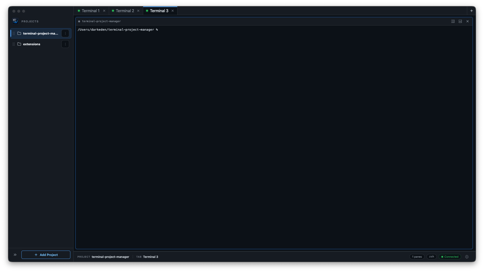
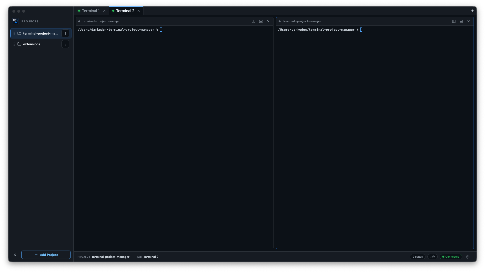

# Swath

Swath is a fast, terminal-first desktop workspace manager for developers and coding agents. It keeps your projects, terminal tabs, split panes, shell profiles, and local environment setup in one sharp Electron app so you can jump between work without rebuilding your terminal layout every time.



## Why Swath

Swath is built for people who live in terminals all day and want their project context to stay organized.

- Keep every project in a dedicated workspace.
- Start terminals directly inside each workspace folder.
- Use tabs for separate flows like app server, tests, database, and agents.
- Split panes horizontally or vertically when one terminal is not enough.
- Resize panes and keep your preferred layout between launches.
- Tune fonts, cursor behavior, shell profiles, and global environment variables.
- Move fast with a quiet, dark, Ghostty-inspired interface.

## Screenshots

### Workspace

Projects live in the sidebar, terminal tabs stay across the top, and the active pane has quick controls for splitting and closing.


### Split Panes

Split panes keep related terminal sessions visible side by side without leaving the workspace.



## Features

- Cross-platform Electron app for macOS, Windows, and Linux packaging.
- Local project/workspace list with add, remove, rename, and drag-to-reorder.
- Multiple terminal tabs per workspace.
- Horizontal and vertical split panes.
- Resizable split ratios that persist across app launches.
- xterm.js terminal rendering with fit, search, and web-link addons.
- Real PTY-backed shells through `node-pty`.
- Configurable terminal font, font size, line height, cursor style, and cursor blink.
- Shell profiles for `zsh`, `bash`, PowerShell, Command Prompt, or custom commands.
- Global environment variables applied to newly spawned panes.
- Optional confirmation before closing panes.
- SQLite-backed local config storage.

## Tech Stack

- Electron
- React
- TypeScript
- Vite / electron-vite
- xterm.js
- node-pty
- better-sqlite3
- Zustand
- electron-builder

## Getting Started

Install dependencies:

```bash
npm install
```

Start the development app:

```bash
npm run dev
```

`node-pty` is a native dependency. The `postinstall`, `predev`, and `prebuild` scripts run `electron-builder install-app-deps` so native modules are rebuilt for Electron.

## Useful Commands

| Command | What it does |
| --- | --- |
| `npm run dev` | Starts Swath in development mode. |
| `npm run typecheck` | Runs TypeScript without emitting files. |
| `npm test` | Runs the terminal paste test script. |
| `npm run build` | Builds app assets into `out/`. |
| `npm run dist` | Builds packaged installers into `release/`. |
| `npm run install:mac` | Builds and installs Swath to `/Applications` on macOS. |
| `npm run install:win` | Builds Swath and creates a Windows Start Menu shortcut. |

## Keyboard Shortcuts

| Shortcut | Action |
| --- | --- |
| `Cmd/Ctrl + Shift + O` | Add workspace |
| `Cmd/Ctrl + T` | New terminal tab |
| `Cmd/Ctrl + W` | Close terminal tab |
| `Cmd/Ctrl + \` | Split active pane right |
| `Cmd/Ctrl + Shift + \` | Split active pane down |
| `Cmd/Ctrl + Shift + W` | Close active pane |
| `Cmd/Ctrl + ,` | Open settings |

## Persistence

Swath stores app configuration locally in Electron's user data directory as `swath.sqlite3`.

Saved between launches:

- Workspace list and order
- Active workspace
- Terminal tabs
- Split layouts and split ratios
- Active tab and active pane
- Terminal appearance settings
- Shell profiles
- Global environment variables

Not restored after restart:

- Running terminal processes
- Terminal scrollback
- Process state
- Shell environment changes made after startup

Swath intentionally restores the workspace shape, not the running process tree. That keeps startup predictable while preserving the layout you care about.

## Packaging

Build distributable packages with:

```bash
npm run dist
```

Artifacts are written to `release/`. The current `electron-builder` config targets:

- macOS: DMG and ZIP
- Windows: NSIS and ZIP
- Linux: AppImage and tar.gz

## Project Structure

```text
src/shared/      Cross-process domain types and typed IPC contracts
src/main/        Electron main process, IPC handlers, services, app lifecycle
src/renderer/    React UI split into app, state, services, domain, and features
scripts/         Install helpers and tests
docs/screenshots README screenshots
public/          Static renderer assets
```

The core persisted model is generic: a `Workspace` owns named `WorkspaceView` records, each view owns a split `LayoutNode` tree, and each leaf is a `PaneLeaf` with a `PaneKind` such as `terminal`. Terminal processes remain runtime-only and are attached to persisted pane IDs when a pane is started.

## Notes

Swath keeps the implementation intentionally focused: no heavy component framework, no remote service requirement, and no account system. It is a local desktop tool for getting into the right terminal context quickly.
